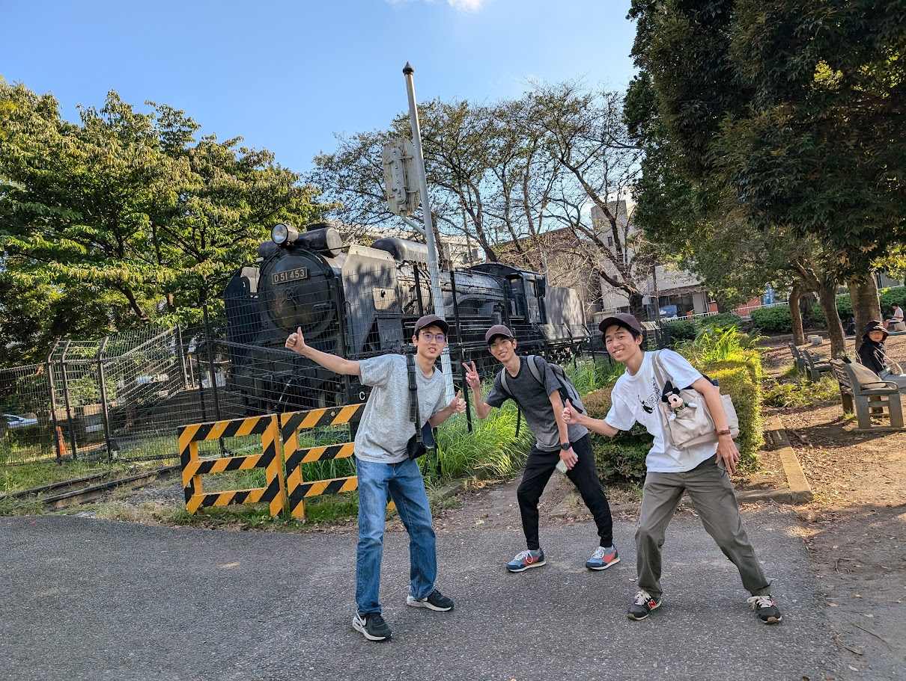
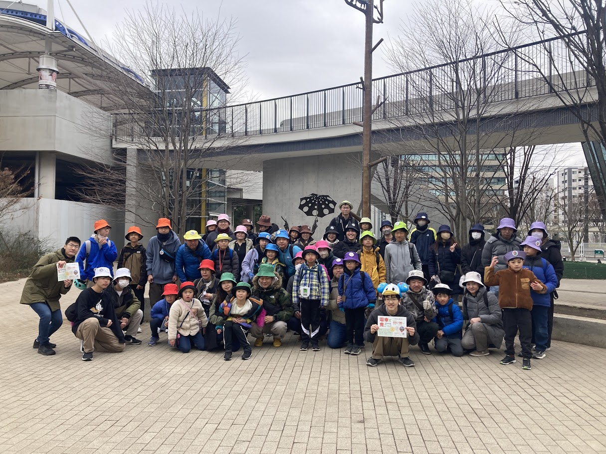

# イベント例

過去に開催された鬼ごっこイベントをご紹介します。  
これらの実例を参考に、あなたも新しいイベントを企画してみませんか？

---

## **流山&柏 鬼ごっこ**

### 📍 **開催エリア**
千葉県の流山市・柏市の全域

### 🚇 **使用路線**
- 東武野田線
- つくばエクスプレス線
- 流鉄流山線
- JR常磐線

### 📋 **イベント概要**
2024年10月に開催した、流山おおたかの森駅を起点として、東武野田線などを活用した大規模な鬼ごっこです。参加者は電車を乗り継ぎながら、鬼チームから逃走し、各駅でのミッションクリアを目指します。

### 🎯 **特色**
- **鉄道会社とコラボ**: 流鉄線の「一日フリー乗車券」を活用し、流鉄株式会社様には、ミッション作成や参加賞などでご協力いただきました。
- **様々なミッション**: 流山・柏地域に詳しい運営スタッフが、地域の魅力を再発見できるミッションを様々設定しました。
- **地域店舗とのコラボ**: 景品提供やミッションの実施などでご協力いただきました。

### 📸 **イベント写真**

*参加者が駅でミッションに挑戦している様子*

---

## **電車で鬼ごっこ ～流山&柏 #2～**

### 📍 **開催エリア**
千葉県の流山市・柏市の全域

### 🚇 **使用路線**
- 東武野田線
- つくばエクスプレス線
- JR常磐線
- 流鉄流山線

### 📋 **イベント概要**
第1回のご好評を受けて開催された第2回目のイベント。前回のフィードバックを受けて、ミッションなどのゲーム設計を作り直しました。

### 📸 **イベント写真**

*参加者と運営スタッフの集合写真*

---

## **参加者の声**

### 💬 **流山&柏 鬼ごっこ参加者**
> 「頭を使いました。頭脳戦が加わった鬼ごっこでした」「ゲームとしての面白さと、ミッションを通して町を知ることができ、新しい発見がありました」

### 💬 **電車で鬼ごっこ ～流山&柏 #2～参加者**
> 「大人も真剣に逃走経路を考えたり、とても楽しめました」「たくさん歩けて健康的です」「街中で鬼ごっこできるのは楽しかったです」

---

**あなたも企画者として参加してみませんか？**  
イベントの企画・運営に興味がある方は、[主催者向けガイド](1_host.md)をご覧ください！
