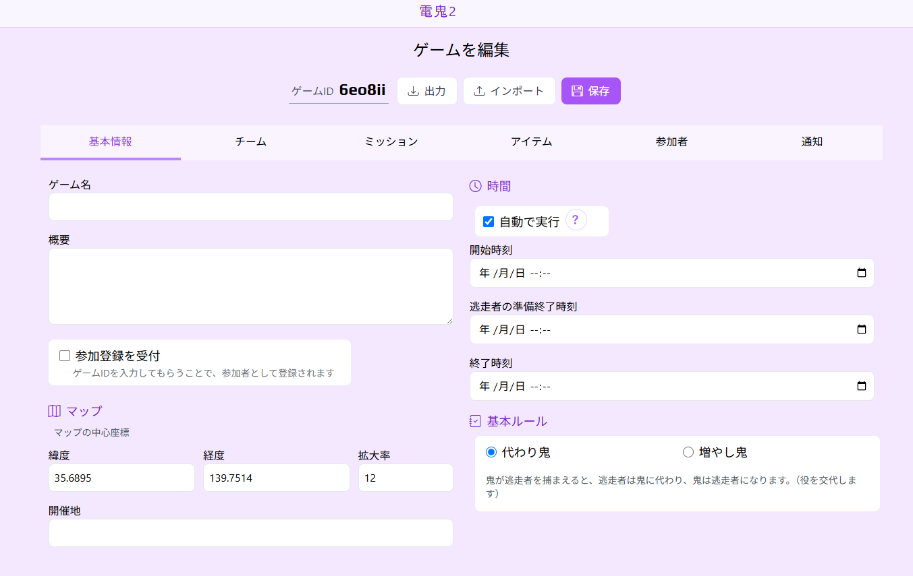

# ゲームの作成と設定

## **🔹 1. ゲームの新規作成**
1. **トップページで「新規作成」ボタンを押す**
2. **ゲームの基本情報を入力**
   - **ゲーム名:** 参加者が識別しやすい名前を設定
   - **概要:** ルールや目的を簡単に記載
   - **参加登録を受付:** チェックを入れると、ゲームIDを入力した参加者を登録可能

3. **開催地・マップ設定**
   - **マップの中心座標（緯度・経度）** を指定
   - **拡大率** を設定（ゲームの範囲に合わせる）
   - **開催地名を入力**（例：東京都新宿区）

4. **開始・終了時刻の設定**
   - **ゲーム開始時間**
   - **逃走者の準備時間**
   - **ゲーム終了時間**

5. **「保存」ボタンを押して設定完了！**

---

## **🔹 2. チームの設定**
1. **「チーム」タブを開く**

2. **新しいチームを追加**
   - 「+ チームを追加」ボタンを押す
   - **チーム名を入力**（例：「チームA」「チームB」）
   - **初期役割（鬼 or 逃走）を設定**
   - **チームの初期スコアを設定**
   - **チームカラーを設定**（参加者が識別しやすい色を選ぶ）

3. **メンバーを追加**
   - 参加者一覧からメンバーを選択してチームに割り当てる

4. **「保存」ボタンを押して設定完了！**

---

## **🔹 3. ミッションの設定**
1. **「ミッション」タブを開く**
2. **「+ ミッションを追加」ボタンを押す**
3. **ミッションの詳細を入力**
   - **ミッションタイトル** を設定（例：「位置情報を送信」）
   - **開始時刻・制限時間** を入力
   - **達成報酬スコア** を設定（クリア時の得点）
   - **未達成時の減点スコア**（任意）

4. **ミッションオプション**
   - 逃走チームのみ提出可能 / 鬼チームのみ提出可能  
   - 自動で繰り返し発令  
   - 画像・位置情報・コメントの提出が必須かどうか  

5. **「保存」ボタンを押して設定完了！**

---

## **🔹 4. アイテムの追加（オプション）**
1. **「アイテム」タブを開く**
2. **「+ アイテムを追加」ボタンを押す**
3. **アイテムの詳細を入力**
   - **アイテム名**（例：「15分間無敵！」）
   - **消費スコア**（アイテム使用時に消費するポイント）
   - **有効時間（分）**（アイテムの効果時間）
   - **詳細説明を記載**（アイテムの効果やルール）

4. **「保存」ボタンを押して設定完了！**

---

## **🔹 5. 参加者の管理**
1. **「参加者」タブを開く**
2. **ゲームIDをコピーし、参加者に共有**
   - 参加者は「ゲームID」を入力して登録

3. **参加者一覧を確認**
   - 登録された参加者が一覧表示される

4. **「保存」ボタンを押して設定完了！**

---

## **🔹 6. 通知設定**
1. **「通知」タブを開く**
2. **通知方法を選択**
   - **Discord Webhook** を設定可能（[Discord Webhookの公式ドキュメント](https://support.discord.com/hc/ja/articles/228383668-) を参照）

3. **通知する項目を選択**
   - **ミッションの発令**
   - **つかまえた・つかまった通知**

4. **「保存」ボタンを押して設定完了！**

---

## **✅ まとめ**
これでゲームの設定が完了しました！  
参加者を集めて、実際に鬼ごっこを開催してみましょう！
