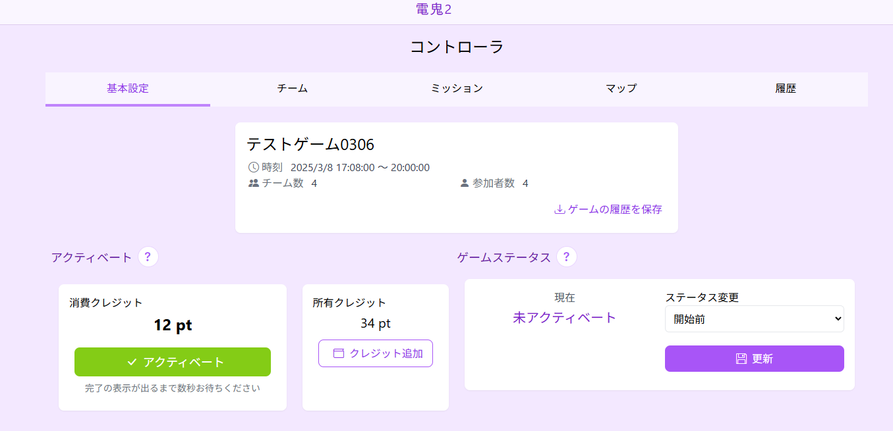
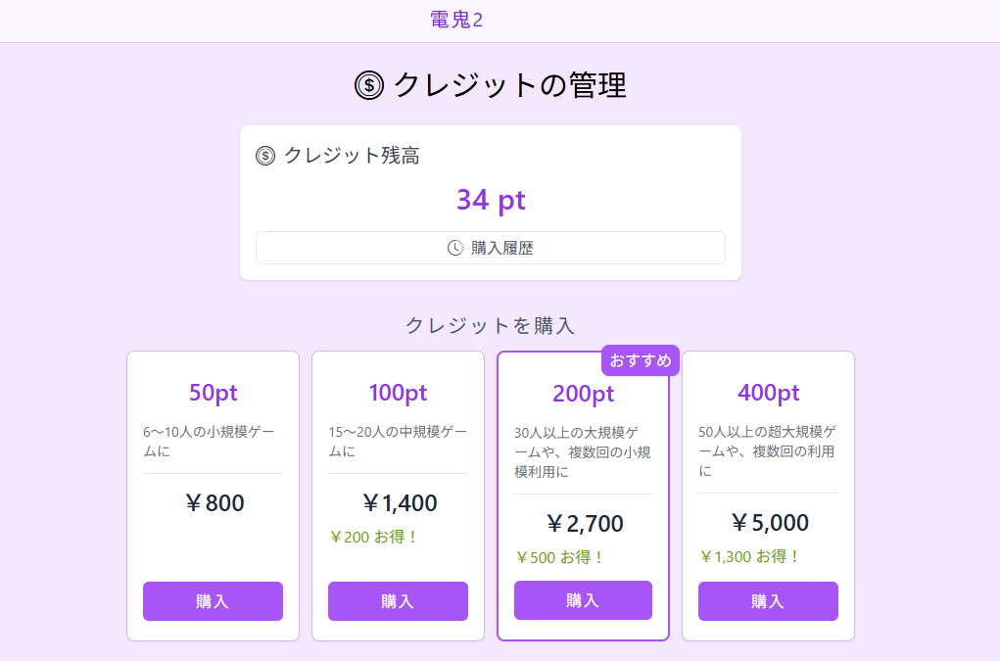
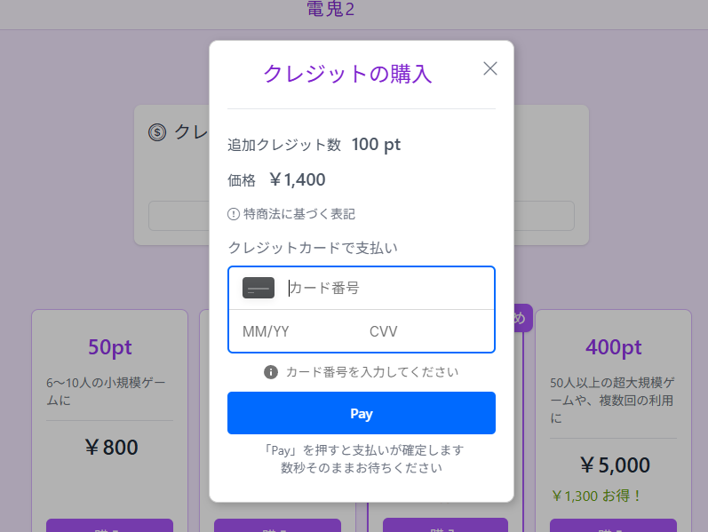

# ゲーム運営の管理

## **🔹 1. コントローラ画面の概要**
主催者は「コントローラ」画面を使用して、ゲームの進行を管理できます。  
**コントローラ画面にアクセスするには:**  
1. **ホーム画面の「作成したゲーム」一覧から「コントローラ」ボタンを押す**

---

## **🔹 2. クレジットの管理**
鬼ごっこを開催するためには、**クレジット**が必要です。  

### **クレジットの購入**
1. **「クレジットの管理」画面を開く** （アカウント→クレジットの管理）
2. **必要なクレジットを選択し、購入手続きを行う**
   - 50pt（小規模ゲーム向け）
   - 100pt（中規模ゲーム向け）
   - 200pt（大規模ゲーム向け・おすすめ）
   - 400pt（超大規模ゲーム向け）

### **クレジットを消費してゲームを有効化**
1. **コントローラ画面の「アクティベート」セクションを開く**
2. **消費クレジット（例: 12pt）を確認し「アクティベート」ボタンを押す**
3. **アクティベートが完了すると、ゲームが開始可能になる**  
   - **手動実行**: 設定したゲーム時間（開始～終了）の間は各種ゲームの操作が可能になります。
   - **自動実行**: ゲームの開始・終了やミッションなど、設定した時間の通りに進行します。
:::caution
アクティベート後は参加登録ができなくなるため、注意してください！
:::

---

## **🔹 3. ゲームの開始と進行**
### **ゲームステータスの管理**
1. **コントローラ画面の「ゲームステータス」セクションを確認**
2. **ゲームの進行状況を手動で変更可能**

ゲームの進行状態は、以下のように変化します。

| ステータス | 状態の説明 |
|------------|------------------------------------------------|
| **開始前** | ゲームがまだ開始されておらず、参加者の登録が可能な状態。アクティベート前なら参加者の追加・編集もできる。 |
| **逃走チーム準備** | 逃走チームのみが移動を開始できるフェーズ。鬼チームはまだ動けず、この時間を使って逃走チームは有利な位置に移動する。 |
| **ゲーム進行中** | 鬼チームが移動できるようになり、鬼ごっこが本格的に開始。鬼は逃走者を確保可能。ミッションの提出やアイテムの使用も可能。 |
| **終了** | ゲームが終了し、その時点での最終ランキングが生成される。これ以降、スコアの変動はなし。 |
| **中断** | ゲームを一時停止。設定されたゲーム時間内であれば、再開が可能。 |

---

## **🔹 4. チーム管理**
### **チームの編集**
1. **「チーム」タブを開く**
2. **各チームの役割・スコアを編集可能**
   - 例: 「初期鬼」チームのスコアを10点に変更
3. **リタイア処理も可能**（リタイアした参加者はゲームから除外）

---

## **🔹 5. ミッション管理**
### **ミッションの発令**
1. **「ミッション」タブを開く**
2. **ミッション一覧から「すぐに発令」ボタンを押す**
3. **発令後、参加者はミッションを実行し、ポイントを獲得可能**

### **ミッションの履歴確認**
- 「受付中」や「終了済み」タブで進行状況をチェックできる
- 受付中の**ミッションの設定を後から変更**することも可能（締切時刻など）

---

## **🔹 6. 位置情報の確認（マップ機能）**
1. **「マップ」タブを開く**
2. **ミッションの提出時に送信された位置情報をマップ上で確認**
   - 位置情報は**ミッションを通して提出**される
   - 時刻のスライダーを動かすと、過去の位置情報も閲覧可能

---

## **🔹 7. ゲームの履歴とログ**
1. **「履歴」タブを開く**
2. **過去のミッション提出や鬼に捕まった記録を一覧表示**
3. **絞り込み検索**（チーム別、イベント別）も可能
4. ゲーム終了時には、「**最終ランキング**」が自動で生成される

---

## **✅ まとめ**
これでゲーム運営の管理ができます！  
アクティベートして、ゲームの進行状況を適切に管理しましょう！
