# 参加者の操作

電鬼アプリを使って、鬼ごっこイベントに参加する方法を説明します。

---

## 1. ゲームに参加する

1. **アカウントを作成**
   - 電鬼アプリにアクセスし、メールアドレス・パスワード・ニックネームを入力してアカウントを作成。
   - ニックネームは他の参加者にも表示されるので、適切なものを設定。
   - 詳しくは[アカウント登録](./1_account-setup.md)をご覧ください

2. **ゲームに参加**
   - ホーム画面の「**参加**」ボタンをタップ。
   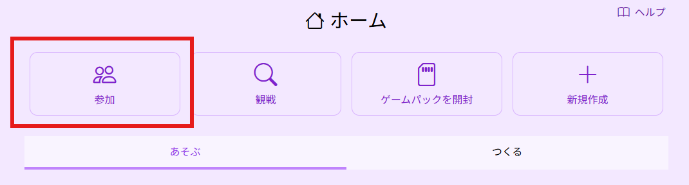
   - 主催者から案内された`ゲームID`を入力すると登録される。
   - または、主催者から共有された`参加用リンク`を開く。
   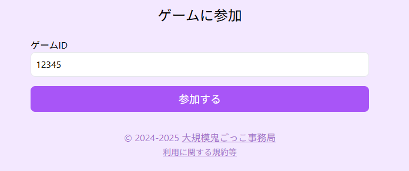

3. **プレイ画面を開く**
   - 主催者によるチーム振り分けとアクティベートの設定が完了すると、参加者は**プレイ画面**を開くことができる。
   - トップページの「**参加するゲーム**」から該当するゲームの「**プレイ**」を選択する。
   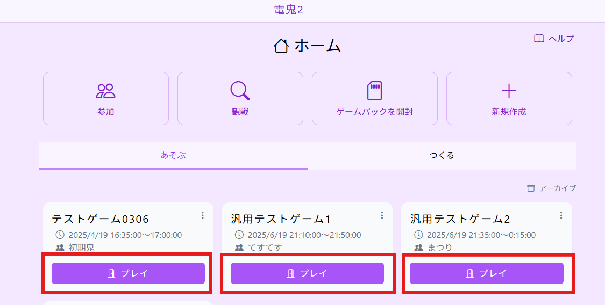
   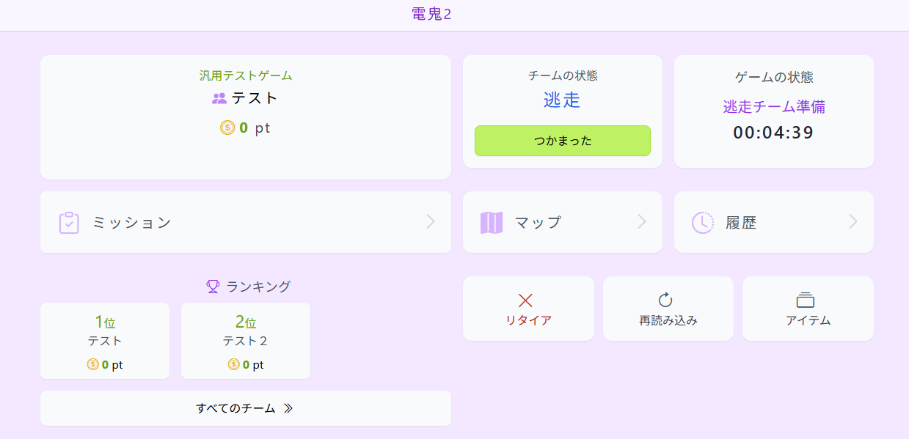

---

## 2. ゲームステータス一覧

| **ステータス** | **説明** |
|--------------|--------------------------------|
| 開始前 | ゲームはまだ開始されておらず、ゲームの操作は不可能。 |
| 逃走チーム準備 | 鬼チームは待機し、逃走チームだけが移動を開始。 |
| ゲーム進行中 | 鬼が逃走者を確保可能な状態。ミッション提出なども可能。 |
| 終了 | ゲーム終了。最終ランキングが確定。 |
| 中断 | 一時的にゲームを停止 |

---

## 3. プレイ中の基本操作

### ミッションの確認と提出
  1. 発令中のミッションを確認
    - 「ミッション」の画面を開き、ミッション一覧を確認します。
    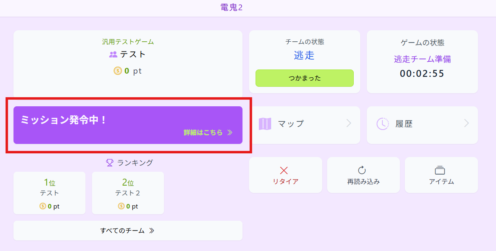
  2. 提出するミッションを開く
    - 一覧の中から、詳細を確認して提出するミッションを選んで開きます。
    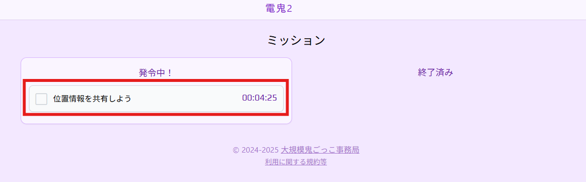
  3. 位置情報や写真を添付して提出する
    - ミッションの詳細を確認します。提出内容の誤りを防ぎます。
    - 位置情報・写真・コメント・QRコードのうち、必要なものを添付します。
    - 必須ではなくても、位置情報や写真、コメントを添付することは可能です。
    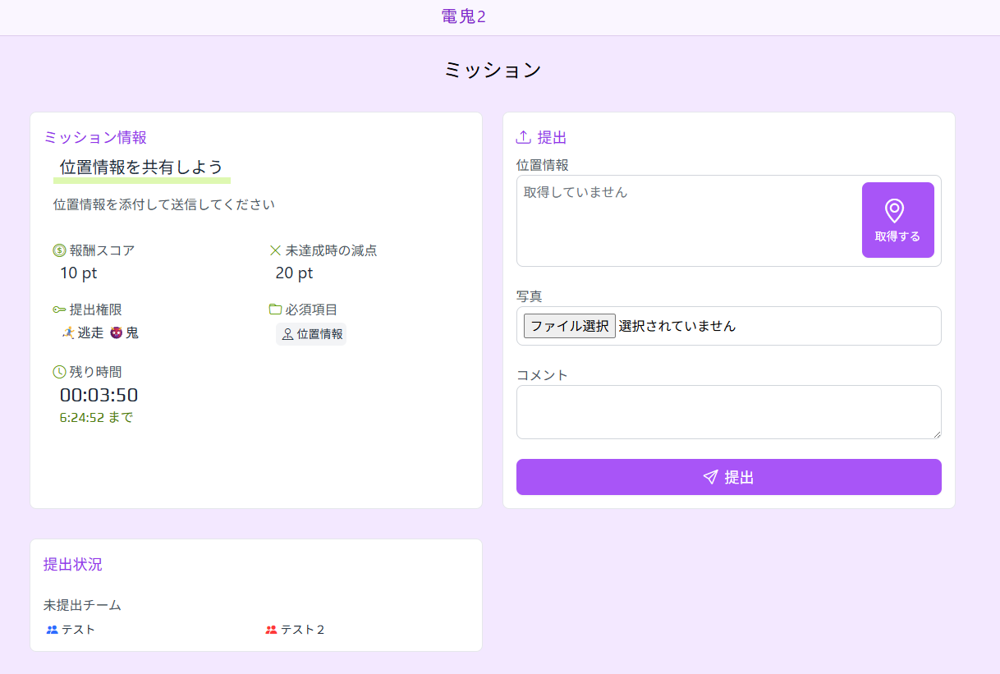
  4. 提出完了の確認
    - ミッション一覧にチェックが入っていたらOKです。
    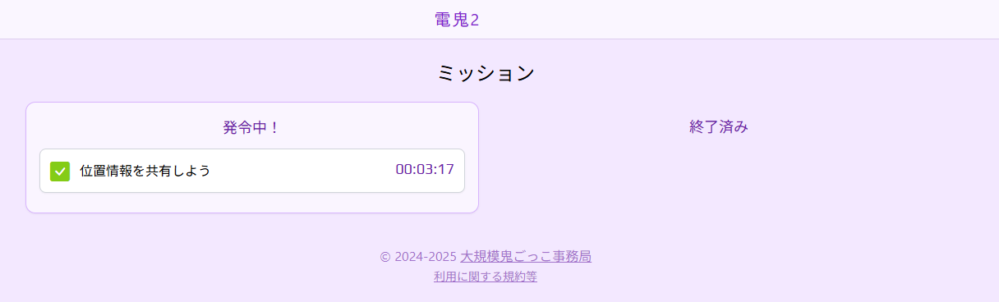

### 捕まえた / 捕まった場合の報告
  1. 「つかまえた / つかまった」画面を開く
    - 「つかまえた」 「つかまった」のボタンを押します。
    - 画像は、逃走チームが捕まった場合を例に示します。
    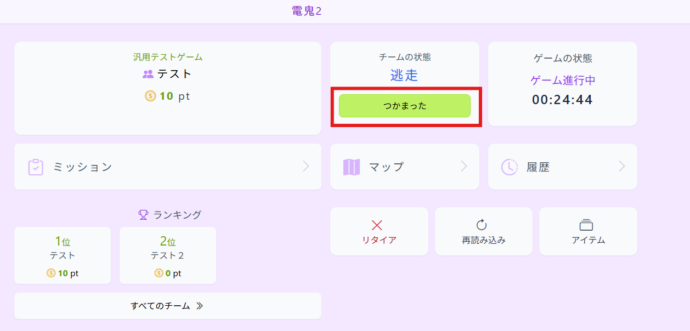
  2. 相手チームを選択
    - 自動的に位置情報が送信され、近い順にチームが表示されます。
    - チームが間違っていないことを確認し、チーム名を押します。
    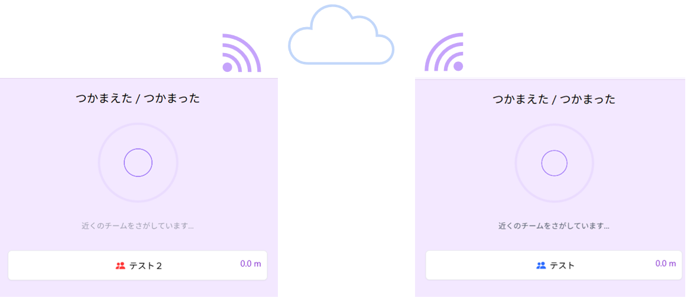
  3. 役が交代されたことを確認
    - 数秒待つと、相手と役の交代が行われ、点数計算も自動的に行われます。
    - ゲームトップ画面で、チームのステータスが変更されたことを確認します。
    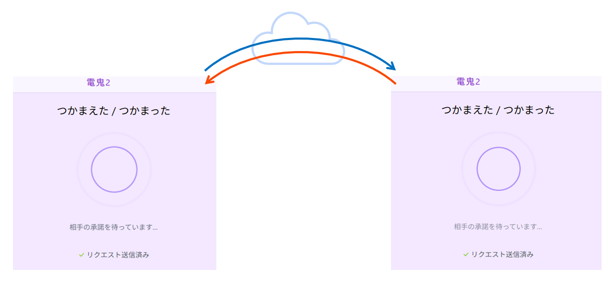
    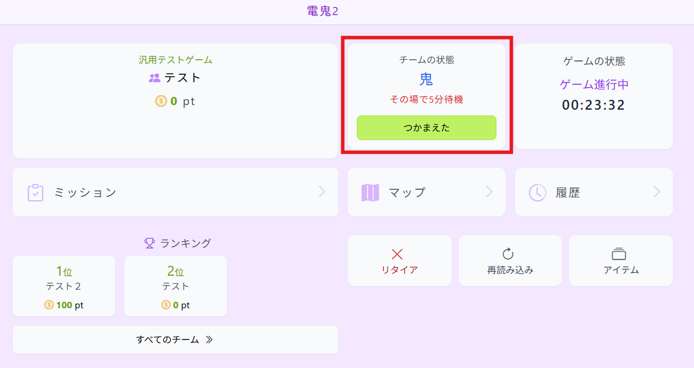

### ランキングの確認

### ログの確認

---

## 4. その他の機能

### **ランキング**
- プレイヤーのスコアがリアルタイムで更新され、順位が表示される。

### **アイテム**
- アイテムを購入・使用し、ゲームを有利に進めることが可能。
  - 例：「15分間無敵」など。

### **マップ**
- 提出された位置情報をもとに、移動履歴を確認できる。

---

## 5. ゲーム終了後
- ゲーム終了時に最終ランキングが確定。
- 結果をシェアしたり、次回のゲームに備えよう！

---

これで、電鬼アプリを使ってスムーズに鬼ごっこを楽しめます！🔥
